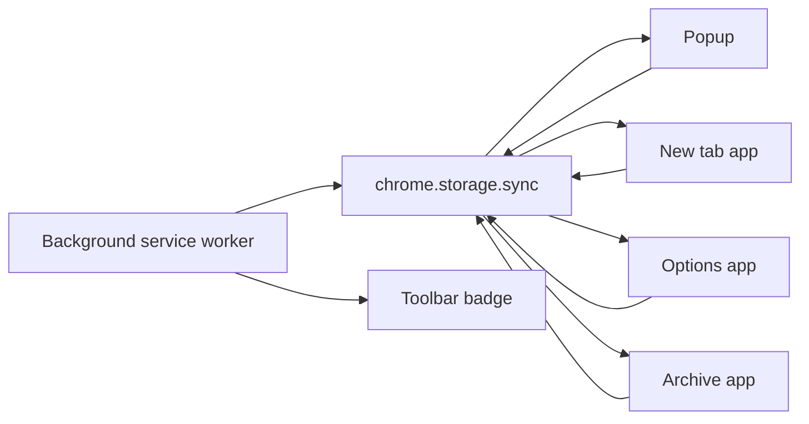

# Read Later Extension

A Chrome Manifest V3 extension for saving tabs to a personal reading list and surfacing one suggested article every time a new tab opens.

The project is built with Svelte 5, TypeScript, Vite, and Tailwind CSS v4. It has no backend. All state lives in `chrome.storage.sync`, so the popup, new tab page, archive, options page, and background service worker all coordinate through the browser extension APIs.

## What the extension does

- Saves the current tab to a read-later list.
- Shows a suggested unread item on the overridden new tab page.
- Lets the user skip, open, mark read, or remove saved items.
- Stores read items in an archive view.
- Lets the user configure suggestion order, theme, color scheme, toolbar behavior, and link target.
- Updates the toolbar badge when the current tab is already saved.

## Application surfaces

The extension is split into a few independent entry points:

- `popup.html` -> toolbar popup for saving or marking the current page as read.
- `newtab.html` -> overridden browser new tab page and the main reading experience.
- `options.html` -> full settings page.
- `archive.html` -> internal extension page for read items.
- `service-worker.js` -> background logic for badge updates.

All four UI pages are Svelte apps. They do not talk to each other directly. Instead, they react to shared storage changes.

## Architecture at a glance



### Core idea

`chrome.storage.sync` is the single source of truth.

- Items are stored in `items`.
- User preferences are stored in `settings`.
- Every page loads from storage on mount.
- Pages that need live updates subscribe to `chrome.storage.onChanged`.
- The theme system also listens to storage changes so appearance updates apply immediately.

There is no custom event bus, no server, and no persistent client-side store beyond the extension storage APIs.

## Data model

Types live in [`src/lib/types.ts`](/Users/giokaxo/Code/experiments/read-later-extension/src/lib/types.ts).

### `ReadLaterItem`

Each saved tab is stored as:

```ts
{
  id: string
  url: string
  title: string
  favicon: string
  savedAt: number
  readAt: number | null
}
```

Meaning:

- `savedAt` is the creation timestamp.
- `readAt === null` means the item is still unread.
- `readAt !== null` means the item has moved logically into the archive.

### `ExtensionSettings`

Settings control both behavior and presentation:

- `algorithm`: `chronological` | `reverse-chronological` | `random`
- `appearance`: `system` | `light` | `dark`
- `colorScheme`: themed accent palette
- `toolbarAction`: `popup` | `auto-save`
- `linkTarget`: `same-tab` | `new-tab`

Defaults are defined in [`src/lib/settings.ts`](/Users/giokaxo/Code/experiments/read-later-extension/src/lib/settings.ts), and every storage read is normalized so partial or missing settings still produce a complete configuration object.

## How the app works

## 1. Shared storage layer

[`src/lib/storage.ts`](/Users/giokaxo/Code/experiments/read-later-extension/src/lib/storage.ts) is the central persistence module.

It provides:

- `getAll()` to read the full storage snapshot.
- `saveItem()` to append a saved tab.
- `markAsRead()` to timestamp `readAt`.
- `removeItem()` to delete an item.
- `updateSettings()` to persist merged settings.
- `bumpItem()` to move an item later in chronological order by refreshing `savedAt`.
- `isItemSaved()` to detect whether the current URL is already in the unread list.
- `selectSuggestion()` to choose the unread item shown on the new tab page.

Important behavior:

- Only unread items participate in suggestion selection.
- `chronological` picks the oldest unread item.
- `reverse-chronological` picks the newest unread item.
- `random` picks a random unread item.

## 2. Background service worker

[`src/background/service-worker.ts`](/Users/giokaxo/Code/experiments/read-later-extension/src/background/service-worker.ts) has a very narrow job: keep the toolbar badge in sync with the active tab.

It listens to:

- `chrome.tabs.onActivated`
- `chrome.tabs.onUpdated`
- `chrome.storage.onChanged`

For the active tab URL, it checks whether that page is already saved and unread:

- if yes, it shows a green `✓` badge
- if not, it clears the badge

This worker does not save items, pick suggestions, or manage UI state.

## 3. Popup flow

The popup lives in [`src/popup/Popup.svelte`](/Users/giokaxo/Code/experiments/read-later-extension/src/popup/Popup.svelte).

On mount it:

1. Queries the active tab.
2. Reads storage.
3. Branches based on `settings.toolbarAction`.

### Popup mode: `popup`

The popup behaves like a small control panel:

- If the current page is not saved, it offers `Save for Later`.
- If the current page is already saved, it offers `Mark as Read`.
- It also shows up to five recent unread items.
- Clicking a recent item navigates the current tab to that URL.

### Popup mode: `auto-save`

When the toolbar action is `auto-save`, opening the extension immediately attempts to save the active tab:

- If the tab URL is valid and not already saved, a new item is created and the current tab is closed.
- If the URL is already saved, the popup shows a confirmation state instead.
- Restricted URLs like `chrome://` and `chrome-extension://` are ignored.

The restricted URL helper is implemented in [`src/lib/format.ts`](/Users/giokaxo/Code/experiments/read-later-extension/src/lib/format.ts).

## 4. New tab experience

The main product surface lives in [`src/newtab/NewTab.svelte`](/Users/giokaxo/Code/experiments/read-later-extension/src/newtab/NewTab.svelte).

This page:

- loads all items and settings on mount
- listens for storage updates
- computes unread items
- selects one active suggestion
- renders the rest of the unread items as the reading pile

### Suggestion selection

The suggestion card is driven by:

- the current unread list
- the configured algorithm
- a temporary in-memory `skippedIds` set for random mode

Skip behavior differs by algorithm:

- `random`: skipping only excludes the current item for the life of that page session.
- chronological / reverse-chronological: skipping calls `bumpItem()`, which changes `savedAt` and therefore changes ordering in storage.

### Reading

When the user clicks `Read Now`:

- the item is marked as read first
- navigation happens after that
- navigation target depends on `settings.linkTarget`

This means the new tab page is both a launcher and the place where items move into the archive.

### Reading pile

The unread items that are not currently suggested appear in the reading pile:

- collapsed by default
- expanded on hover
- sortable oldest-first or newest-first
- removable or markable as read

The key UI pieces are:

- [`src/lib/components/suggestion-card.svelte`](/Users/giokaxo/Code/experiments/read-later-extension/src/lib/components/suggestion-card.svelte)
- [`src/lib/components/reading-pile.svelte`](/Users/giokaxo/Code/experiments/read-later-extension/src/lib/components/reading-pile.svelte)
- [`src/lib/components/reading-pile-item.svelte`](/Users/giokaxo/Code/experiments/read-later-extension/src/lib/components/reading-pile-item.svelte)

## 5. Archive page

The archive lives in [`src/archive/Archive.svelte`](/Users/giokaxo/Code/experiments/read-later-extension/src/archive/Archive.svelte).

It subscribes to storage and displays only items where `readAt !== null`, sorted by most recently read first.

Actions available there:

- open the original URL in a new tab
- permanently remove the archived item

Read items are not stored separately. The archive is just a filtered view of the same `items` array.

## 6. Settings and theming

Settings UI is centered in [`src/lib/components/settings-editor.svelte`](/Users/giokaxo/Code/experiments/read-later-extension/src/lib/components/settings-editor.svelte).

That component is reused in two places:

- [`src/options/Options.svelte`](/Users/giokaxo/Code/experiments/read-later-extension/src/options/Options.svelte) for the full settings page
- [`src/newtab/NewTab.svelte`](/Users/giokaxo/Code/experiments/read-later-extension/src/newtab/NewTab.svelte) inside a modal

Important behavior:

- It loads the current settings from storage on mount.
- Unsaved changes are kept in local component state.
- Theme choices preview immediately via `applyThemeSettings()`.
- Clicking save persists the merged settings back to storage.

### Theme system

Theme logic lives in [`src/lib/theme.ts`](/Users/giokaxo/Code/experiments/read-later-extension/src/lib/theme.ts), and shared CSS variables live in [`src/app.css`](/Users/giokaxo/Code/experiments/read-later-extension/src/app.css).

Every page entry (`popup`, `newtab`, `options`, `archive`) does the same bootstrap:

1. import global CSS
2. call `initializeTheme()`
3. mount the Svelte app

`initializeTheme()`:

- reads settings from storage
- resolves `system` appearance using `matchMedia`
- updates the root element with `dark` and `data-color-scheme`
- listens for both OS theme changes and storage changes
- returns a cleanup function used on page unload

Because of that, a theme change made in one surface is reflected across the others without a reload.

## Build and bundling

Vite configuration lives in [`vite.config.ts`](/Users/giokaxo/Code/experiments/read-later-extension/vite.config.ts).

The build is configured as a multi-entry extension bundle:

- `popup.html`
- `newtab.html`
- `options.html`
- `archive.html`
- `src/background/service-worker.ts`

Output behavior:

- entry files are emitted as stable names like `popup.js` and `service-worker.js`
- chunks go into `dist/chunks`
- static assets go into `dist/assets`

The extension manifest is in [`public/manifest.json`](/Users/giokaxo/Code/experiments/read-later-extension/public/manifest.json). Vite copies it into the final build output.

## Project structure

```text
src/
  archive/           Archive entry point
  background/        Manifest V3 service worker
  lib/
    components/      Shared Svelte components and UI primitives
    format.ts        URL/date formatting helpers
    settings.ts      Default settings + normalization
    storage.ts       Extension persistence and selection logic
    theme.ts         Runtime theme initialization
    types.ts         Shared TypeScript types
  newtab/            New tab application
  options/           Settings page entry point
  popup/             Toolbar popup entry point
  app.css            Global design tokens and Tailwind theme mapping
public/
  manifest.json      Chrome extension manifest
  icons/             Extension icons
```

## Development

Install dependencies with your preferred package manager. The repository currently includes a `bun.lock`, but the scripts are standard Vite scripts and work with `bun`, `npm`, or similar tooling.

### Useful scripts

- `bun install`
- `bun run dev` -> start Vite dev server
- `bun run dev:ext` -> rebuild the extension bundle in watch mode
- `bun run build` -> create a production build in `dist`
- `bun run check` -> run Svelte and TypeScript checks

### Loading the extension in Chrome

1. Build the project with `bun run build`.
2. Open `chrome://extensions`.
3. Enable Developer Mode.
4. Click `Load unpacked`.
5. Select the generated `dist` directory.

If you are iterating on the extension UI, `bun run dev:ext` is the most useful script because it continuously rebuilds the actual extension bundle.

## Notes and implementation details

- Storage uses `chrome.storage.sync`, so behavior depends on browser extension sync support rather than a local database.
- Duplicate detection only checks unread items with the same URL.
- Marking an item as read does not delete it; it timestamps `readAt`.
- The archive is an internal extension page, not a manifest-declared top-level surface.
- The background worker is intentionally minimal and only manages the badge state.

## Where to start when changing behavior

- Saving or read-state logic: [`src/lib/storage.ts`](/Users/giokaxo/Code/experiments/read-later-extension/src/lib/storage.ts)
- Popup behavior: [`src/popup/Popup.svelte`](/Users/giokaxo/Code/experiments/read-later-extension/src/popup/Popup.svelte)
- New tab recommendation flow: [`src/newtab/NewTab.svelte`](/Users/giokaxo/Code/experiments/read-later-extension/src/newtab/NewTab.svelte)
- Settings UI and persistence: [`src/lib/components/settings-editor.svelte`](/Users/giokaxo/Code/experiments/read-later-extension/src/lib/components/settings-editor.svelte)
- Theme runtime: [`src/lib/theme.ts`](/Users/giokaxo/Code/experiments/read-later-extension/src/lib/theme.ts)
- Extension wiring: [`public/manifest.json`](/Users/giokaxo/Code/experiments/read-later-extension/public/manifest.json)
